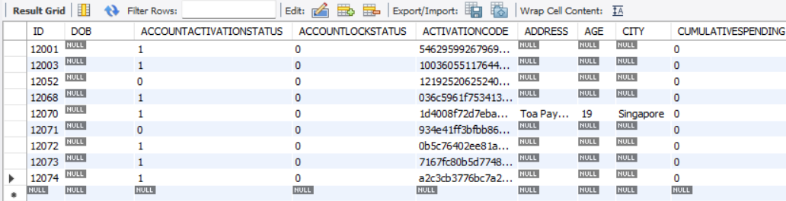

# SEP

## INTRODUCTION:
### Step 1:
1. create .env

2. put this inside:
```
STRIPE_SECRET_KEY=(direct message us for the key)
```

### Step 2: Install the required module
```
npm i
```

### Step 3: Run the server
```
node server.js
```

### Step 4: When logging in as a user
You may get an error when registering and login due to the system requiring you to validate your account in your email.

- The email will not work due to possible TLS error due to your firewall. Instead go to your Workbench and go to the 'memberentity' table.

- Update ACCOUNTACTIVATIONSTATUS from 0 to 1 accordingly to your row. Below is the image for reference



- It should be able to login now.